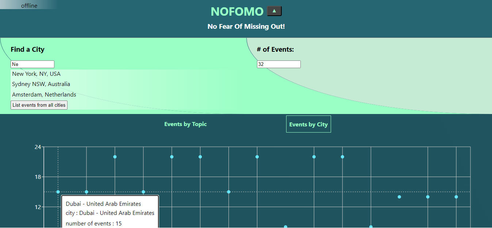
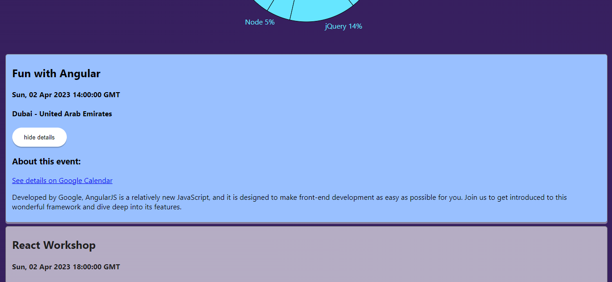

<!-- Markdown syntax here: https://www.markdownguide.org/basic-syntax/ -->
<a id="readme-top"></a>
<br />

<div align="center">
  <a href="https://guyrimel.github.io/Portfolio-Site/index.html">
    
  </a>

  <h3 align="center">Date Night Movies (React)</h3>

  <p align="center">
    Find a movie you'll <em>both</em> enjoy on date night! Date Night Movies is the client side web application built with React. Create an account, securely login, view movie data, and save movies to your favorites in this colorful light-weight knock-off of the uber-popular <a href="https://www.imdb.com/" target="_blank">IMDb website</a>.
  </p>
</div>
<br />

<!-- TABLE OF CONTENTS -->

<details>
  <summary>Table of Contents</summary>
  <ol>
    <li>
      <a href="#about-the-project">About The Project</a>
      <ul>
        <li><a href="#key-features">Key Features</a></li>
        <li><a href="#built-with">Built With</a></li>
        <li><a href="#deployments">Deployments</a></li>
        <li><a href="#dev-notes">Dev Notes</a></li>
      </ul>
    </li>
    <li>
      <a href="#getting-started">Getting Started</a>
      <ul>
        <li><a href="#prerequisites">Prerequisites</a></li>
        <li><a href="#installation">Installation</a></li>
        <li><a href="#quick-start">Quick Start</a></li>
        <li><a href="#ux-notes">UX Notes</a></li>
      </ul>
    </li>
    <li><a href="#license">License</a></li>
  </ol>
</details>

<!-- ABOUT THE PROJECT -->

## About The Project

<!-- SCREENSHOT -->



[Date Night Movies (React) Repository](https://github.com/GuyRimel/Date-Night-Movies-React)

<!-- KEY FEATURES -->

### Key Features

1. Create a user account and login with a username and password with JWT Authentication, password hashing.

2. Search for and view information about movies, genres, and directors.

3. Save movies to your favorites for later reference.

<!-- BUILT WITH -->

### Built With

- HTML, CSS, JavaScript

- JSX, SCSS

- React

- Parcel (compiler)

<p align="right">(<a href="#readme-top">back to top</a>)</p>

<!-- DEPLOYMENTS -->
## Deployments

Date Night Movies (React) is currently live and hosted with Netlify. This app uses a separately deployed RESTful API to handle routing and endpoints. There are currently two Date Night Movies frontend deployments, one developed with React (this one) and one developed with Angular.

- [Date Night Movies (API)](https://datenightmovies.herokuapp.com/)

- [Date Night Movies React Frontend](https://datenightmovies.netlify.app/)

- [Date Night Movies Angular Frontend](https://guyrimel.github.io/Date-Night-Movies-Angular/)

<p align="right">(<a href="#readme-top">back to top</a>)</p>

<!-- DEV NOTES -->

## Dev Notes

- The Date Night Movies (API) uses JWT Tokens for login authorization. Tokens are stored in localStorage (not a cookie!) and expire in 7 days.

- For details about API endpoints, visit the <a href="https://datenightmovies.herokuapp.com/documentation" target="_blank">documentation</a>.

<p align="right">(<a href="#readme-top">back to top</a>)</p>

<!-- GETTING STARTED -->

## Getting Started

<!-- PREREQUISITES -->

### Prerequisites

1. Git installed globally

2. Node Version Manager (NVM) *and* Node.js installed globally


<p align="right">(<a href="#readme-top">back to top</a>)</p>

<!-- INSTALLATION -->

### Installation

1. In the terminal, navigate to the desired directory and clone the repo.

   ```sh
   git clone https://github.com/GuyRimel/Date-Night-Movies-React.git
   ```

<p align="right">(<a href="#readme-top">back to top</a>)</p>

<!-- QUICK START -->

### Quick Start

After installation...

1. Still in the terminal, run the following:

   ```sh
   npm install
   ```

2. Compile and run a local server with Parcel by running the following:

   ```sh
   npm run start
   ```

The app will then automatically open in a new browser window.

<p align="right">(<a href="#readme-top">back to top</a>)</p>

<!-- UX NOTES -->

## UX Notes

- First, create a new account with your desired "Username", "Password", "Email", and "Birthday" (Birthday optional).

- Upon successful account creation, login with your credentials.

- Favorite movies by clicking the movie card's "heart icon". View your favorite movies in your profile.

<p align="right">(<a href="#readme-top">back to top</a>)</p>

<!-- SCREENSHOTS -->
## Screenshots




<p align="right">(<a href="#readme-top">back to top</a>)</p>

<!-- LICENSE -->
## License

Distributed under the MIT License. See <a href="LICENSE.txt" target="_blank">`LICENSE.txt`</a> for more information.

<p align="right">(<a href="#readme-top">back to top</a>)</p>
